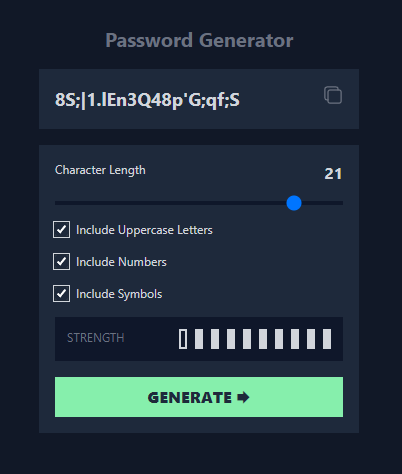

# Password Generator

You can test a ** [demo here](https://password-generator.dpuentel.com/) **.

## 🚀 Project Description

This is a React Password Generator.

The page is over Astro, a static site generator for modern web apps.

## 🧑‍💻 Project Tech Stack

### 🚀 [Astro](https://astro.build/)

Astro is the web framework that is used to build the project. It's fast, lightweight and make life easier.

### ⚛️ [React](https://reactjs.org/)

React is used to build some UI components.

### 🎨 [TailwindCSS](https://tailwindcss.com/)

Tailwind CSS to fast style and build custom designs.

### 📦 [Dinahosting VPS](https://www.dinahosting.com/)

The [demo](https://password-generator.dpuentel.com/) is deployed to a VPS from Dinahosting using a GitHub Action.
