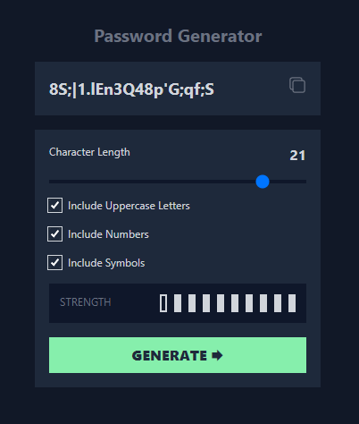

# Password Generator

You can test a **[demo here](https://password-generator.dpuentel.com/)**.

## 🚀 Project Description

Generates cryptographically secure passwords using `window.crypto.getRandomValues()`. Features password strength analysis with entropy calculation, character set customization, and copy-to-clipboard.

## 🧑‍💻 Project Tech Stack

| Package | Version |
|---------|---------|
| [Astro](https://astro.build/) | 6.3.5 |
| [React](https://reactjs.org/) | 19.2.6 |
| [TailwindCSS](https://tailwindcss.com/) | 4.3.0 |
| [Vitest](https://vitest.dev/) | 4.1.6 |
| [ESLint](https://eslint.org/) | 10.4.0 |
| [Prettier](https://prettier.io/) | 3.8.3 |

### 📦 [Dinahosting VPS](https://www.dinahosting.com/)

The [demo](https://password-generator.dpuentel.com/) is deployed to a VPS from Dinahosting using a GitHub Action.

## 🛠️ Available Scripts

| Command | Description |
|---------|-------------|
| `pnpm dev` | Start dev server |
| `pnpm build` | Build for production |
| `pnpm preview` | Preview production build |
| `pnpm test` | Run tests once |
| `pnpm test:watch` | Run tests in watch mode |
| `pnpm test:coverage` | Run tests with coverage report |
| `pnpm run format` | Format code with Prettier |
| `pnpm run lint:eslint` | Lint with ESLint |
| `pnpm run lint:eslint:fix` | Auto-fix ESLint issues |
